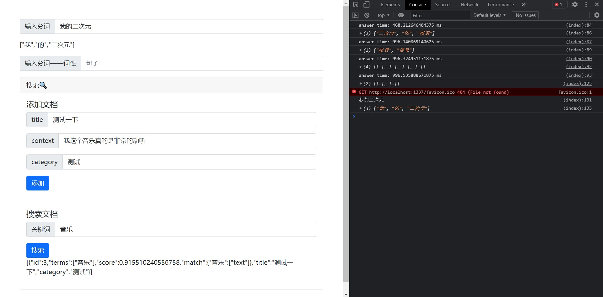

# bsearch 

# Brief 简介
WASM built RustJieba, make in browser Chinese search possible!  
使用了rust编译的jieba中文分词，使得可以在浏览器中实现中文分词  
以及**最重要**的是使用了中文的搜索

# Example 例子

# 使用说明 
Makefile中有启动的命令  
建议可以使用`make webStart2`来启动